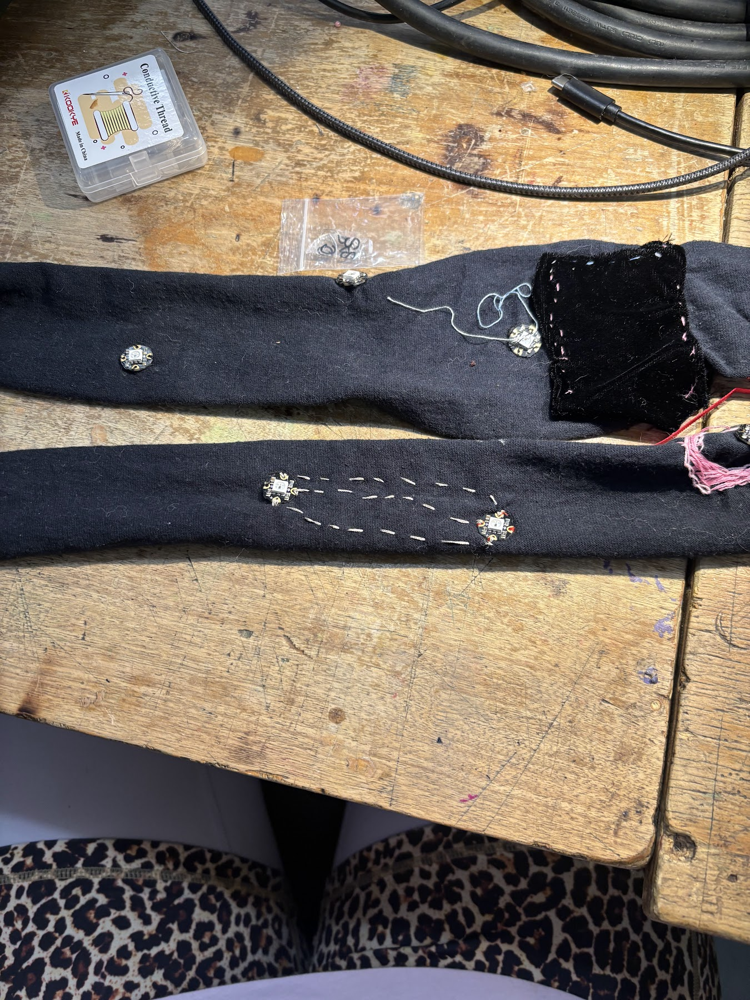

<link rel='stylesheet' href='style.css'>

## Resistance Sparkles

## Dev Process

### Basic Stitch
This was my very first stitch. Basic circuit connecting two addressable LEDs.

### Improving
1. Have whatever you are sewing stretched. This matters an insane amount.
2. [Adafruit's YouTube tutorial](https://learn.adafruit.com/getting-started-with-flora/overview) on stitching technique is highly helpful.
3. Patience

